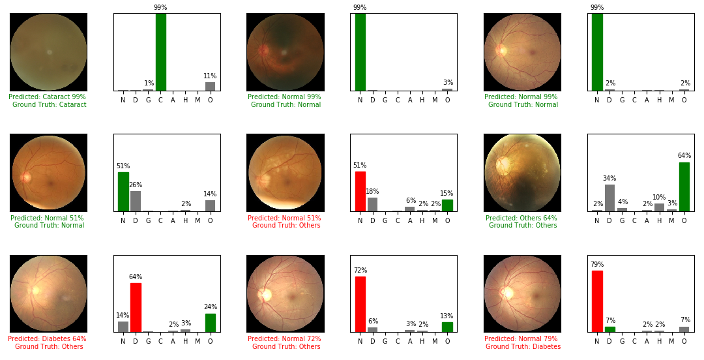

# Eye Disease Recognition AML
## Abstract
The classification of eye disease is a fundamental process in medicine to be able to take the necessary actions, regarding the patient, additionally, it has an incidence 2.2 billion of people in the world, which is why this article it is proposed to use of deep learning through networks convolutional, specifically using the Resnet50 network, to perform its classification automatically between Normal, Diabetes, Glaucoma, Cataract, Macular Degeneration (AMD), Hypertension, Myopia, Other diseases was used a dataset provided by Shanggong Medical Technology Co. Ltd, obtaining a final result of 68.9\% in the average of F1-metrics, Kappa metrics, and AUC metric.   Additionally was evaluated Stargan network in the generation of retinal images affects AMD, Hypertension, and Myopia. 

## Proposed Method
In order to run the method properly, you must install the following libraries:  
Tensorflow:
```cmd 
conda install -c conda-forge tensorflow 
```
Matplotlib:
```cmd 
conda install -c conda-forge matplotlib
```
Sklearn:
```cmd 
conda install -c anaconda scikit-learn
```
Seaborn:
```cmd 
conda install -c anaconda scikit-learn
```
CV2:
```cmd 
conda install -c conda-forge/label/gcc7 opencv
```
Absl:
```cmd 
conda install -c anaconda absl-py
```
In case of using the original data of the challenge, place all the files in the following folders, however, if you are using the folders located in the BCV0001 machine, ignore the following three steps:  
```cmd
ODIR-5K_Training_Dataset
ODIR-5K_Testing_Images
```
And create the following folders
```cmd
ODIR-5K_Testing_Images_cropped
ODIR-5K_Testing_Images_treated_224
ODIR-5K_Training_Dataset_cropped
ODIR-5K_Training_Dataset_treated_224
```
Then run the following commands, which will take about an hour and a half to run:
```cmd
python odir_image_crop_job.py
python odir_image_testing_crop_job.py
python odir_training_image_treatment_job.py
python odir_testing_image_treatment_job.py
```
And finally run the following command:
```cmd
python odir_patients_to_numpy.py
```

To run the proposed method use the following command.
```cmd
python main.py --mode test --file_load_model model_weights.h5 --file_npy_labels odir_testing_labels_224.npy --file_npy odir_testing_224.npy --folder results
```
On the other hand, if you want to observe the classification in a specific example, you must run the following line:
```cmd
python main.py --mode demo --filename /media/user_home2/ynsuarez/AML/Proyecti/ODIR-5K/Testing_Images_treated_224/1000_left.jpg
```
